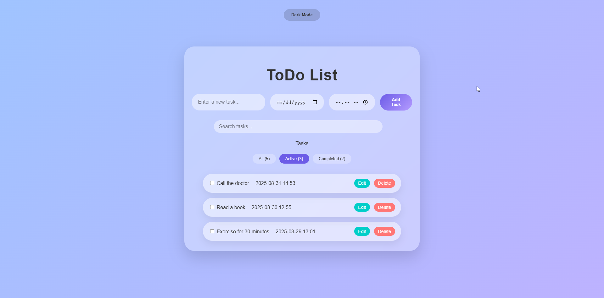

# ToDo List Project

A simple and interactive ToDo List application with Dark/Light Mode, Drag & Drop tasks, and Notification reminders.

---

## Features

- **Add, Edit, Delete tasks** easily  
- **Mark tasks as completed**  
- **Drag & Drop** tasks to reorder  
- **Dark & Light Mode** toggle  
- **Notification reminder** for upcoming tasks  
- **Search tasks** by title  
- **Filter tasks**: All / Active / Completed  

---

## Screenshots

  
  
  
  
  

---

## How to Run

1. Clone the repository:  
```bash
git clone https://github.com/salehinezhad/todo-app.git
